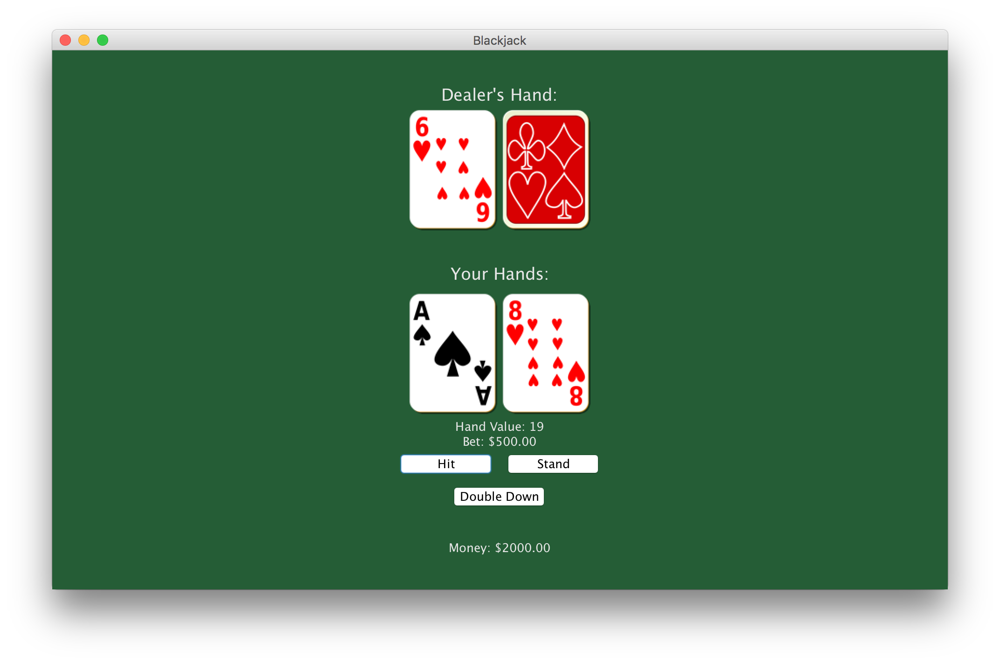
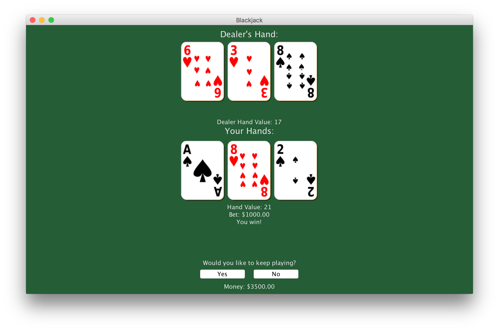

# Blackjack

This is a multiplayer Blackjack card game with a server and client. The server acts as the house and creates new tables for players to join through the client. Every player starts with a certain amount of money and must place a minimum bet each round. Players can leave after each round or will be kicked out when they do not have enough money to place the minimum bet. The dealer hits on a soft 17. All other rules are standard Blackjack rules.

## How to Play

Follow these instructions to play Blackjack. It can be played singleplayer by running both the server and client on the same computer, or multiplayer by running the server on one computer and clients on others using the server address option listed below.

### Prerequisites

* Java SE 9

### Running

To run the server and client, navigate to the directory containing the JAR files and enter the following commands. The server must be started before the client.

```
java -jar BlackjackServer.jar

java -jar BlackjackClient.jar
```

### Options

Options that can be used when running the server and client are listed below. None of the options are required to run the server or client.

#### Server

**-p** serverPort

* Port to run the server on.
* Default: 44444

**-t** playersPerTable

* Specifies the number of players per table.
* Default: 1

**-m** startingMoney

* Specifies the amount of money players start with.
* Default: 2500

**-b** minimumBet

* Specifies the minimum bet players must place.
* Default: 500

**-d** numberOfDecks

* Specifies the number of decks in the shoe.
* Default: 6

**-c** minimumCardsBeforeShuffle

* Specifies the minimum number of cards remaining before shuffling the shoe.
* Default: 78

#### Client

**-a** serverAddress

* Server IP address to connect to.
* Default: localhost

**-p** serverPort

* Server port to connect to.
* Default: 44444

## Screenshots





## License

This project is licensed under the MIT License. See the [LICENSE.md](LICENSE.md) file for details.
